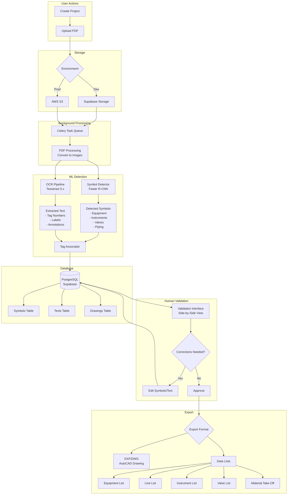
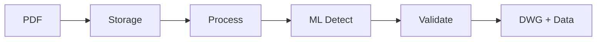
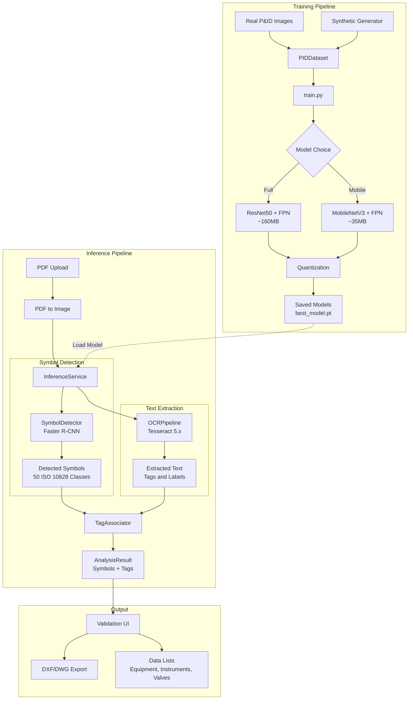

# Flowex Workflow Diagrams

This document contains Mermaid diagrams explaining the Flowex symbol detection and processing workflow.

## Full System Workflow

## Simplified Linear Flow

## Symbol Detection Pipeline

## Key Components

| Component | File | Purpose |
|-----------|------|---------|
| **Model** | `ml/training/model.py` | Faster R-CNN with ResNet50+FPN |
| **Mobile Model** | `ml/training/model_mobile.py` | Lightweight MobileNetV3 variant |
| **Training** | `ml/training/train.py` | Training loop & checkpoints |
| **Dataset** | `ml/training/dataset.py` | COCO format data loading |
| **Symbol Classes** | `ml/training/symbol_classes.py` | 50 ISO 10628 P&ID symbols |
| **Inference** | `backend/app/ml/inference.py` | Production inference service |
| **OCR** | `backend/app/ml/ocr_pipeline.py` | Tesseract text extraction |
| **Processing** | `backend/app/tasks/processing.py` | Celery background task |

## Data Flow Summary

| Step | Input | Output | Technology |
|------|-------|--------|------------|
| 1. Upload | PDF file | Stored file | Supabase/S3 |
| 2. Process | PDF | Images | Celery + Redis |
| 3. Detect | Images | Symbols (50 classes) | PyTorch, ResNet50+FPN |
| 4. OCR | Images | Text & tags | Tesseract 5.x |
| 5. Validate | Detections | Corrected data | React UI |
| 6. Export | Validated data | DWG + Lists | ezdxf |

## Symbol Categories (ISO 10628)

The system detects 50 symbol classes across 4 categories:

- **Equipment (15)**: Vessels, pumps, compressors, heat exchangers, tanks, etc.
- **Instruments (20)**: Transmitters, controllers, indicators, sensors, etc.
- **Valves (13)**: Gate, globe, ball, check, control valves, etc.
- **Piping (2)**: Lines, connections
